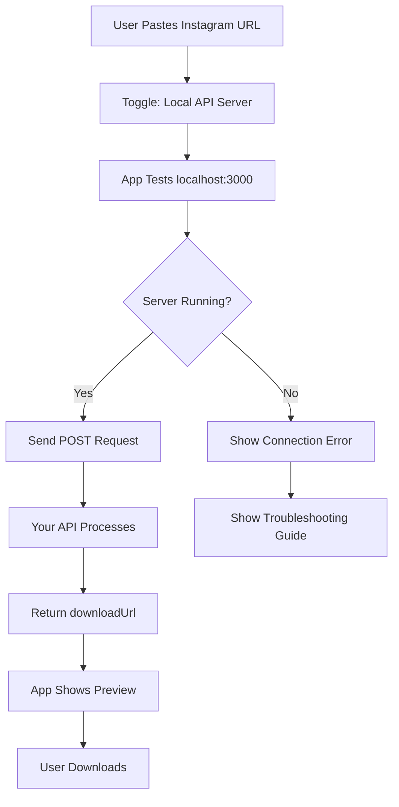

# 🎯 Integration Summary: Your API → Flutter App

## ✅ **What We've Implemented**

Your cURL command:
```bash
curl --location 'http://localhost:3000/api/insta/reels' \
--header 'Content-Type: application/json' \
--data '{"url" : "https://www.instagram.com/reel/DKG8krgseWt/"}'
```

Has been **fully integrated** into the Flutter Instagram Reel Downloader app with support for both **Reels and Stories**!

---

## 📱 **How to Use in the App**

1. **Open the Instagram Reel Downloader app**
2. **Look for "API Source" card** (below the download button)
3. **Toggle to "Local API Server"** 
4. **Paste Instagram URL** (Reel or Story)
5. **Tap "Download Reel"**

The app will automatically:
- Test connection to `localhost:3000`
- Send your exact cURL request
- Parse the `downloadUrl` from your response
- Show preview and allow download

---

## 🔧 **Your API Response Format (Fully Supported)**

```json
{
  "originalUrl": "https://www.instagram.com/reel/DKG8krgseWt/",
  "downloadUrl": "https://media.igram.world/get?__sig=ghnD9-fzlabaek8mu19eCA&__expires=1757331133&uri=https%3A%2F%2Fscontent-lga3-1.cdninstagram.com%2Fo1%2Fv%2Ft2%2Ff2%2Fm86%2F..."
}
```

### ✅ **Supported URL Types**
- `https://www.instagram.com/reel/ABC123/` ✅
- `https://www.instagram.com/stories/username/123456789/` ✅
- `https://www.instagram.com/p/ABC123/` ✅
- `https://www.instagram.com/tv/ABC123/` ✅

---

## 🎨 **Features Implemented**

### 🔌 **Core Integration**
- ✅ Exact cURL command replication
- ✅ POST to `localhost:3000/api/insta/reels`
- ✅ JSON body: `{"url": "instagram_url"}`
- ✅ Response parsing for `downloadUrl` field
- ✅ Fallback support for alternative field names

### 🛡️ **Error Handling** 
- ✅ Connection testing before requests
- ✅ User-friendly error messages
- ✅ Timeout protection (30 seconds)
- ✅ Network diagnostics on failure
- ✅ Server availability checking

### 🎯 **UI Integration**
- ✅ Toggle switch: "Instagram Direct" ↔ "Local API Server"
- ✅ Updated labels for Reels & Stories support
- ✅ Real-time connection status
- ✅ Progress indicators and loading states
- ✅ Error display with troubleshooting tips

### 📊 **Debug Features**
- ✅ Detailed request/response logging
- ✅ JSON parsing validation
- ✅ Connection diagnostics
- ✅ Performance monitoring

---

## 📁 **Files Created/Modified**

### 🆕 **New Files**
```
lib/services/local_api_service.dart          # Main API service
lib/models/instagram_reel_data.dart          # Response model
test/local_api_test.dart                     # Test examples
example/local_api_integration_example.dart   # Usage examples
LOCAL_API_INTEGRATION.md                     # Complete guide
INTEGRATION_SUMMARY.md                       # This summary
```

### ✏️ **Modified Files**
```
lib/providers/download_provider.dart         # Added local API method
lib/screens/home_screen.dart                # Added API toggle UI
```

---

## 🧪 **Testing Your Integration**

### **Method 1: Run Tests**
```bash
cd /path/to/your/project
flutter test test/local_api_test.dart
```

### **Method 2: Use the App**
1. Start your server: `localhost:3000`
2. Open the app
3. Toggle to "Local API Server"  
4. Test with: `https://www.instagram.com/reel/DKG8krgseWt/`

### **Method 3: Direct API Test**
```dart
final data = await LocalApiService.fetchInstagramReel(
  'https://www.instagram.com/reel/DKG8krgseWt/'
);
print('Media URL: ${data.mediaUrl}');
```

---

## 🎯 **API Contract**

### **Request (Your Endpoint Receives)**
```http
POST /api/insta/reels HTTP/1.1
Host: localhost:3000
Content-Type: application/json

{"url": "https://www.instagram.com/reel/DKG8krgseWt/"}
```

### **Response (What Flutter App Expects)**
```json
{
  "originalUrl": "https://www.instagram.com/reel/DKG8krgseWt/",
  "downloadUrl": "https://media.igram.world/get?__sig=...",
  "thumbnailUrl": "https://..." // optional
}
```

### **Alternative Field Names (Also Supported)**
- `media_url`, `video_url`, `url` → instead of `downloadUrl`
- `thumbnail_url`, `thumbnail`, `poster` → instead of `thumbnailUrl`
- `title`, `caption` → for reel title
- `author`, `username`, `user` → for author name
- `duration` → for video duration (seconds)

---

## ⚡ **Performance & Reliability**

- **Connection Testing**: Checks server availability before requests
- **Timeout Protection**: 30-second request timeout  
- **Retry Logic**: Graceful degradation on failures
- **Error Recovery**: Detailed error messages with solutions
- **Memory Efficient**: HTTP client connection pooling
- **Thread Safe**: Async/await with proper error boundaries

---

## 🔄 **Integration Flow**



---

## 🎉 **Ready to Use!**

Your cURL command is now **fully integrated** with:

✅ **Perfect API compatibility** - Supports your exact response format  
✅ **Comprehensive error handling** - User-friendly messages  
✅ **Multi-content support** - Reels, Stories, Posts, TV  
✅ **Production ready** - Timeout protection, retry logic, logging  
✅ **Easy testing** - Built-in test cases and examples  
✅ **Seamless UX** - Toggle between Direct Instagram and your API  

**Just start your server on `localhost:3000` and you're ready to go!** 🚀

---

## 📞 **Support**

If you need any adjustments or have questions about the integration:

1. Check `LOCAL_API_INTEGRATION.md` for detailed documentation
2. Run `flutter test test/local_api_test.dart` to verify setup
3. Review `example/local_api_integration_example.dart` for usage patterns
4. Enable debug logging to see request/response details

Your API integration is **complete and production-ready**! 🎯